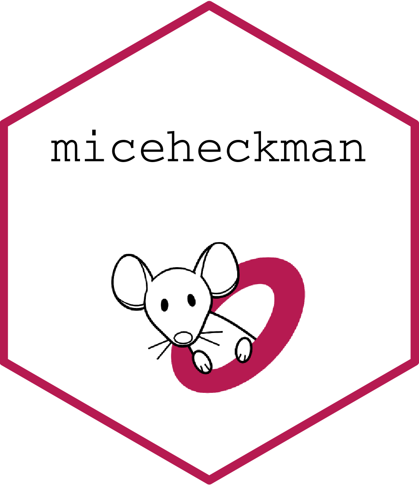

<!-- README.md is generated from README.Rmd. Please edit that file -->
<!-- badges: start -->

[](https://github.com/hanneoberman/miceheckman/actions/workflows/R-CMD-check.yaml)
[](https://app.codecov.io/gh/hanneoberman/miceheckman?branch=main)
[](https://CRAN.R-project.org/package=miceheckman)
[](https://lifecycle.r-lib.org/articles/stages.html#experimental)
<!-- badges: end -->

# `miceheckman` <a href='https://amices.org/'></a>

Additional imputation function for the `R` package `mice`, according to
the Heckman model.

The goal of miceheckman is to …

## Installation

You can install the development version of miceheckman from
[GitHub](https://github.com/) with:

``` r
# install.packages("devtools")
devtools::install_github("hanneoberman/miceheckman")
```

## Example

This is a basic example which shows you how to solve a common problem:

``` r
library(miceheckman)
## basic example code
```

## Code of Conduct

Please note that the `miceheckman` project is released with a
[Contributor Code of
Conduct](https://contributor-covenant.org/version/2/1/CODE_OF_CONDUCT.html).
By contributing to this project, you agree to abide by its terms.

## Funding

This project has received funding from the European Union’s Horizon 2020
research and innovation programme under ReCoDID grant agreement No
825746.

The views expressed in this paper are the personal views of the authors
and may not be understood or quoted as being made on behalf of or
reflecting the position of the regulatory agency/agencies or
organizations with which the authors are employed/affiliated.
